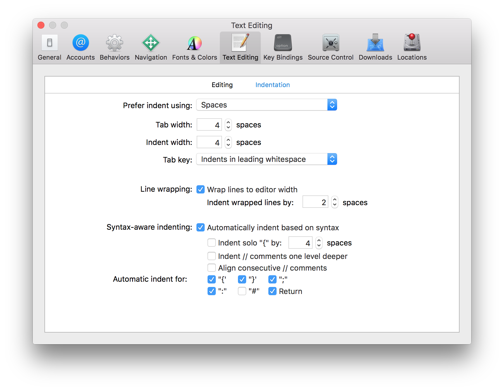
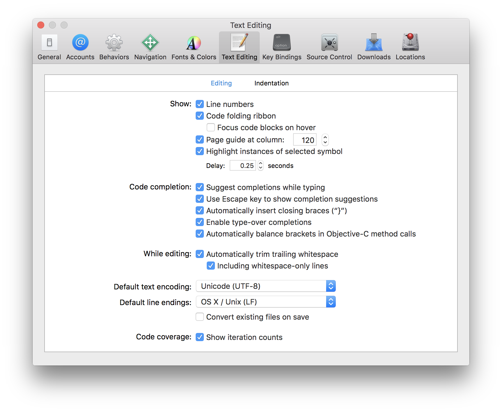

# Swift Style Guide

This is an attempt to encourage patterns that accomplish the following goals (in rough
priority order):

1. Increased rigor, and decreased likelihood of programmer error
2. Increased clarity of intent
3. Reduced verbosity
4. Fewer debates about aesthetics

## Table of Contents

- [Naming](#naming)
    - [Camel Case](#camel-case)
    - [Class Prefixes](#class-prefixes)
- [Whitespace](#whitespace)
    - [General Spacing](#general-spacing)
    - [Colon Placement](#colon-placement)
    - [Grouping](#grouping)
    - [Attributes](#attributes)
- [Line Length](#line-length)
- [Comments](#comments)
- [Variables](#variable)
    - [Prefer `let` over `var`](#prefer-let-over-var)
    - [Order of Declaration Specifiers](#order-of-declaration-specifiers)
    - [Separate Line for each Variable or Property](#separate-line-for-each-variable-or-property)
- [Optionals](#optionals)
    - [Optional Binding](#optional-binding)
    - [Force Unwrapping](#force-unwrapping)
    - [Implicitly Unwrapped Optionals](#implicitly-unwrapped-optionals-iuos)
- [Control Flow](#control-flow)
    - [`for`](#for)
    - [`switch`](#switch)
- [Closures](#closures)
- [Computed Properties](#computed-properties)
- [Types](#types)
    - [Native Swift Types](#native-swift-types)
    - [Prefer Structs over Classes](#prefer-structs-over-classes)
    - [`final` by Default](#final-by-default)
- [Extensions](#extensions)
    - [Protocol Conformance](#protocol-conformance)
    - [Code Organization](#code-organization)
- [Brevity](#brevity)
    - [Inference](#inference)
    - [Use of `self`](#use-of-self)
    - [Syntactic Sugar](#syntactic-sugar)
    - [Parentheses](#parentheses)
    - [Semicolons](#semicolons)
- [Golden Path](#golden-path)
- [Miscellaneous](#miscellaneous)
    - [Multiline Collections](#multiline-collections)
    - [Struct Initializers](#struct-initializers)
    - [Custom Operators](#custom-operators)
- [Language](#language)
- [Credits](#credits)

## Naming

### Camel Case

Use descriptive names with camel case for classes, methods, variables, etc.

Use `UpperCamelCase` for following:

- Types (struct, class, enum, typedef)
- Enumeration values

Use `lowerCamelCase` for the following:

- Variables (global as well)
- Properties (static and class as well)
- Functions
- Methods

**Preferred:**
```swift
private let maximumWidgetCount = 100

class WidgetContainer {
    var widgetButton: UIButton
    static let widgetHeightPercentage = 0.85
}

enum Shape {
    case Rectangle
    case Square
    case Triangle
    case Circle
}
```

**Not Preferred:**
```swift
private let MAX_WIDGET_COUNT = 100

class app_widgetContainer {
    var wBut: UIButton
    static let HeightPct = 0.85
}

enum Shape {
    case rectangle
    case square
    case triangle
    case circle
}
```

### Class Prefixes

Do not use class prefixes.

_Rationale:_ Swift types are automatically namespaced by the module that contains them. If two names from different modules collide you can disambiguate by prefixing the type name with the module name.

```swift
import SomeModule

let myClass = MyModule.UsefulClass()
```

## Whitespace

### General Spacing

- Indent with 4 spaces.
- End files with a newline.
- Don’t leave trailing whitespace.
    - Not even leading indentation on blank lines.
- Braces always open on the same line as the statement but close on a new line. This includes braces for methods, types (eg. `struct`/`class`/`enum`) and control statements (eg. `if`/`else`/`switch`/`while`).
- Leave no space between a function/method name and its argument list.

_Rationale:_ The default for Xcode and Apple's templates is 4 spaces. Files should end with a newline because OS X is a Unix operating system, and many tools will point out when you don't end with a newline. The remaining points are simply style choices, heavily influenced by the Swift community.




**Preferred:**
```swift
struct User {

    func happy(isHappy: Bool) {
        if isHappy {
            // Do something
        } else {
            // Do something else
        }
    }
}
```

**Not Preferred:**
```swift
struct User
{
  func happy (isHappy: Bool)
  {
    if isHappy
    {
      // Do something
    }
    else {
      // Do something else
    }
  }
}
```

### Colon Placement

#### Type of an Identifier

When specifying the type of an identifier, always put the colon immediately after the identifier, followed by a space and then the type name.

```swift
class SmallBatchSustainableFairtrade: Coffee { ... }

extension SmallBatchSustainableFairtrade: Organic { ... }

let timeToCoffee: NSTimeInterval = 2

func makeCoffee(type: CoffeeType) -> Coffee { ... }
```

_Rationale:_ The type specifier is saying something about the _identifier_ so it should be positioned with it.

#### Dictionary Key Type

When specifying the type of a dictionary, always put the colon immediately after the key type, followed by a space and then the value type. This is the same rule as above, but explicitly called out to prevent ambiguity.

```swift
let capitals: [Country: City] = [Sweden: Stockholm]
```

### Grouping

- Spacing:
    - Leave a single blank line at the start of a type declaration or extension.
    - Leave a single blank line before and after `// MARK:` or other grouping related comments.
    - Otherwise don't leave whitespace at the beginning or end of a scope.
- Group items in a type declaration or extension following this priority:
    - Type aliases
    - Properties
    - Init
    - Methods
    - Public
    - Internal
    - Private
- Make liberal use of single blank lines to divide code into logical chunks. Some pre-defined logical chunks are:
    - Functions
    - Commented items
- Extract out groups into extensions according to [Code Organization](#code-organization).

_Rationale:_ This is mainly just preference, developed while writing in Swift. From a practical side though, this style closely matches the formatting of the Generated Interface in Xcode.

**Preferred:**
```swift
struct SuperSecretTech {

    public let exposed = true

    // MARK: Grouping comment, should have a blank line above and below

    var happy = true

    private let b = 9
    private let c = 4

    /// This item should be in it's own group, because it has a comment
    private let eleven = 11

    private let twelve = 12

    private let alpha = 7

    func maths() {
        // This comment shouldn't have a blank line above it
        let a = 5 * b
        print("a is \(a)")

        for i in 1...c {
            print("i is \(i)")
        }
    }
}
```

**Not Preferred:**
```swift
struct SuperSecretTech {
    private let b = 9
    private let c = 4
    /// This item should be in it's own group
    private let eleven = 11
    private let twelve = 12

    // MARK: Grouping comment, should have a blank line above and below
    var happy = true
    public let exposed = true
    private let alpha = 7
    func maths() {

        // This comment shouldn't have a blank line above it
        let a = 5 * b
        print("a is \(a)")
        for i in 1...c {
            print("i is \(i)")
        }
    }

}
```

### Attributes

Attributes (eg. `@objc`, `@noreturn`) should be on a new line preceding the declaration or type that they apply to, except for the cases described in the subsections.

_Rationale:_ Attributes are an exceptional case that should stand out when scanning the source.

**Preferred:**
```swift
@objc
class MyViewController: UIViewController {
    // class stuff here
}
```

**Not Preferred:**
```swift
@objc class MyViewController: UIViewController {
    // class stuff here
}
```

#### Same Line for Certain Declarations

The following declarations should have attributes be on the same line as them:

- Properties
- Function arguments
- Imports

_Rationale:_ Properties are usually grouped together, which makes attributes on new lines very verbose. For example, a common attribute to use on properties in iOS is `@IBOutlet`. Function arguments are called out simply to state the obvious that we shouldn't add newlines within our parameter list (same for module imports).

**Preferred:**
```swift
@testable import MyModule
@testable import MyOtherModule

class MyViewController {
    @IBOutlet var loginTextField: UITextField!
    @IBOutlet var passwordTextField: UITextField!
}
```

**Not Preferred:**
```swift
@testable
import MyModule
@testable
import MyOtherModule

class MyViewController {
    @IBOutlet
    var loginTextField: UITextField!
    @IBOutlet
    var passwordTextField: UITextField!
}
```

#### Always Separate Lines for Certain Attributes

The following attributes should always be on a separate line preceding the declaration or type that they apply to, even if they fall in the above classification of "same line for certain declarations", in the following order:

- `@available`
- `@IBDesignable`
- `@IBInspectable`

_Rationale:_ These attributes themselves are very verbose, or signify something special that you want to notice, so putting them on their own line helps in readability.

**Preferred:**
```swift
@available(iOS 8.0, tvOS 9.0, *)
func iOSOnlyFunctionality() {
    // neat iOS only stuff here
}

@IBInspectable
public var: UIColor
```

**Not Preferred:**
```swift
@available(iOS 8.0, tvOS 9.0, *) func iOSOnlyFunctionality() {
    // neat iOS only stuff here
}

@IBInspectable public var: UIColor
```

## Line Length

Lines should generally be no more than 120 characters long.

Exceptions:

- Properties
- Type and extension signatures

In Xcode you can set the "page guide at column" setting in the Text Editing / Editing preferences pane to 120. See [General Spacing](#general-spacing) for a screenshot of this.

_Rationale:_ With default fonts in Xcode, and both side panels open, this allows a single editing pane for 13" rMBP, and two editing panes for external monitors and iMacs. The exceptions are made to prevent weird indenting or readability issues.

## Comments

**TODO:** General comments. Talk about `// MARK`, `// MARK -`, `// TODO:` as well.

**TODO:** Docstrings: `///` instead of `/** ... */`

_Rationale:_ **TODO**

## Variables

### Prefer `let` over `var`

Use `let foo = …` over `var foo = …` wherever possible (and when in doubt). Only use `var` if you absolutely have to (i.e. you *know* that the value might change, e.g. when using the `weak` storage modifier).

_Rationale:_ The intent and meaning of both keywords is clear, but *let-by-default* results in safer and clearer code.

A `let`-binding guarantees and *clearly signals to the programmer* that its value is supposed to and will never change. Subsequent code can thus make stronger assumptions about its usage.

It becomes easier to reason about code. Had you used `var` while still making the assumption that the value never changed, you would have to manually check that.

Accordingly, whenever you see a `var` identifier being used, assume that it will change and ask yourself why.

### Order of Declaration Specifiers

Use the following order for declaration specifiers. When a specifier isn't listed, place it in the order of the category it belongs to, after the listed ones.

- Attributes
    - `@IBOutlet`
    - `@IBAction`
    - `@NSManaged`
    - `@NSCopying`
- Overriding
    - `final`
    - `override`
- Type level
    - `static`
    - `class`
- Access control
    - `public`
    - `internal`
    - `private`
- Dispatch
    - `dynamic`
- Memory management
    - `weak`

_Rationale:_ This is mainly just preference, developed while writing in Swift. From a practical side though, this style closely matches the formatting of the Generated Interface in Xcode.

**Preferred:** _(Doesn't compile because of conflicting specifiers)_
```swift
@IBOutlet @NSManaged @NSCopying final static class private dynamic weak var a: T

@IBAction final override static class private dynamic func b() { }
```

### Separate Line for each Variable or Property

Declare each variable or property on a separate line.

_Rationale:_ By having each variable be on a separate line, versus declaring multiple on the same line, it's easy to see where a variable is declared, and it exposes how many variables are in a scope with a quick glance.

**Preferred:**
```swift
var x = 0.0
var y = 0.0
var z = 0.0
```

**Not Preferred:**
```swift
var x = 0.0, y = 0.0, z = 0.0
```

## Optionals

Declare variables and function return types as optional with `?` where a nil value is acceptable.

When naming optional variables and properties, avoid naming them like `optionalString` or `maybeView` since their optional-ness is already in the type declaration.

When accessing an optional value, use optional chaining if the value is only accessed once or if there are many optionals in the chain:

```swift
self.textContainer?.textLabel?.setNeedsDisplay()
```

### Optional Binding

Use optional binding when it's more convenient to unwrap once and perform multiple operations:

```swift
if let textContainer = self.textContainer {
    // do many things with textContainer
}
```

For optional binding, shadow the original name when appropriate rather than using names like `unwrappedView` or `actualLabel`. Also, put control flow in the same statement if it's the only valid path.

_Rationale:_ **TODO**

**Preferred:**
```swift
var subview: UIView?
var volume: Double?

// later on...
if let subview = subview, volume = volume where volume >= 11.0 {
    // do something with unwrapped subview and volume only when volume >= 11
}
```

**Not Preferred:**
```swift
var optionalSubview: UIView?
var volume: Double?

if let unwrappedSubview = optionalSubview {
    if let realVolume = volume {
        if volume >= 11 {
            // do something with unwrappedSubview and realVolume only when volume >= 11
        }
    }
}
```

### Force Unwrapping

If you have an identifier `foo` of type `FooType?` or `FooType!`, don't force-unwrap it to get to the underlying value (`foo!`) if possible.

Instead, use optional binding as described above:

```swift
if let foo = foo {
    // Use unwrapped `foo` value in here
} else {
    // If appropriate, handle the case where the optional is nil
}
```

Or, if it only makes sense for the value to be non-nil, use `guard`:

```swift
guard let foo = foo else {
    return
}

// Use unwrapped `foo` value here
```

_Rationale:_ Explicit `if let`-binding of optionals results in safer code. Force unwrapping is more prone to lead to runtime crashes.

### Implicitly Unwrapped Optionals (IUOs)

Where possible, use `let foo: FooType?` instead of `let foo: FooType!` if `foo` may be nil (Note that in general, `?` can be used instead of `!`). Use implicitly unwrapped types declared with `!` only for instance variables that you know will be initialized later before use, such as subviews that will be set up in `viewDidLoad`, or `@IBOutlet`s that are wired up as part of Storyboard loading.

_Rationale:_ Explicit optionals result in safer code. Implicitly unwrapped optionals have the potential of crashing at runtime.

## Control Flow

### `for`

Prefer the `for-in` style of `for` loop over the `for-condition-increment` style.

_Rationale_: `for-in` is more clear and usually performs better (because of fast enumeration).

**Preferred:**
```swift
for _ in 0..<3 {
    println("Hello three times")
}

for (index, person) in enumerate(attendeeList) {
    println("\(person) is at position #\(index)")
}
```

**Not Preferred:**
```swift
for var i = 0; i < 3; ++i {
    println("Hello three times")
}

for var i = 0; i < attendeeList.count; ++i {
    let person = attendeeList[i]
    println("\(person) is at position #\(i)")
}
```

### `switch`

**TODO:** Multiple statements: fallthrough, sameline. `default`

## Closures

### Trailing Closures

Use Trailing closure syntax whenever possible, but only if there's a single closure expression parameter at the end of the argument list.

**TODO:** Closures style in chained methods call: how to handle multiple

### Closure

**TODO:** $0, $1, etc.

**TODO:** Where to place arguments

**TODO:** Where to place type information (if needed) (might go in inference section)

### Spacing

**TODO:** Inner whitespace: `{ $0 > $5 }`

## Computed Properties

If a computed property is read-only, omit the get clause.

_Rationale:_ For conciseness. The get clause is required only when a set clause is provided.

**Preferred:**
```swift
var myGreatProperty: Int {
    return 4
}

subscript(index: Int) -> T {
    return objects[index]
}
```

**Not Preferred:**
```swift
var myGreatProperty: Int {
    get {
        return 4
    }
}

subscript(index: Int) -> T {
    get {
        return objects[index]
    }
}
```

## Types

### Native Swift Types

Always use Swift's native types when available.

_Rationale:_ Swift offers bridging to Objective-C so you can still use the full set of methods as needed.

**Preferred:**
```swift
let width = 120.0                                    // Double
let widthString = (width as NSNumber).stringValue    // String
```

**Not Preferred:**
```swift
let width: NSNumber = 120.0                          // NSNumber
let widthString: NSString = width.stringValue        // NSString
```

### Prefer Structs over Classes

Unless you require functionality that can only be provided by a class (like identity or deinitializers), implement a struct instead.

Note that inheritance is (by itself) usually _not_ a good reason to use classes, because polymorphism can be provided by protocols, and implementation reuse can be provided through composition.

For example, this class hierarchy:

```swift
class Vehicle {
    let numberOfWheels: Int

    init(numberOfWheels: Int) {
        self.numberOfWheels = numberOfWheels
    }

    func maximumTotalTirePressure(pressurePerWheel: Float) -> Float {
        return pressurePerWheel * Float(numberOfWheels)
    }
}

class Bicycle: Vehicle {
    init() {
        super.init(numberOfWheels: 2)
    }
}

class Car: Vehicle {
    init() {
        super.init(numberOfWheels: 4)
    }
}
```

could be refactored into these definitions:

```swift
protocol Vehicle {
    var numberOfWheels: Int { get }
}

func maximumTotalTirePressure(vehicle: Vehicle, pressurePerWheel: Float) -> Float {
    return pressurePerWheel * Float(vehicle.numberOfWheels)
}

struct Bicycle: Vehicle {
    let numberOfWheels = 2
}

struct Car: Vehicle {
    let numberOfWheels = 4
}
```

_Rationale:_ Value types are simpler, easier to reason about, and behave as expected with the `let` keyword.

### `final` by Default

Classes should start as `final`, and only be changed to allow subclassing if a valid need for inheritance has been identified. Even in that case, as many definitions as possible _within_ the class should be `final` as well, following the same rules.

_Rationale:_ Composition is usually preferable to inheritance, and opting _in_ to inheritance hopefully means that more thought will be put into the decision.

## Extensions

### Protocol Conformance

When adding protocol conformance to a type, prefer adding a separate type extension for the protocol methods. Include a `// MARK: -` comment.

_Rationale:_ This keeps the related methods grouped together with the protocol and can simplify instructions to add a protocol to a type with its associated methods. The compiler will provide errors at the extension to keep them local.

**Preferred:**
```swift
class MyViewController: UIViewController {
    // class stuff here
}

// MARK: - UITableViewDataSource

extension MyViewController: UITableViewDataSource {
    // table view data source methods
}

// MARK: - UIScrollViewDelegate

extension MyViewController: UIScrollViewDelegate {
    // scroll view delegate methods
}
```

**Not Preferred:**
```swift
class MyViewController: UIViewController, UITableViewDataSource, UIScrollViewDelegate {
    // all methods
}
```

### Code Organization

**TODO**

## Brevity

### Inference

**TODO:** enum cases

**TODO:** type inference

**TODO:** Omit type parameters where possible

### Use of `self`

When accessing properties or methods on `self`, leave the reference to `self` implicit by default:

```swift
private class History {
    var events: [Event]

    func rewrite() {
        events = []
    }
}
```

Only include the explicit keyword when required by the language—for example, in a closure, or when parameter names conflict:

```swift
extension History {
    init(events: [Event]) {
        self.events = events
    }

    var whenVictorious: () -> () {
        return {
            self.rewrite()
        }
    }
}
```

_Rationale:_ This makes the capturing semantics of `self` stand out more in closures, and avoids verbosity elsewhere.

### Syntactic Sugar

Prefer the shortcut versions of type declarations over the full generics syntax.

**Preferred:**
```swift
var deviceModels: [String]
var employees: [Int: String]
var faxNumber: Int?
```

**Not Preferred:**
```swift
var deviceModels: Array<String>
var employees: Dictionary<Int, String>
var faxNumber: Optional<Int>
```

### Parentheses

Only use parentheses when required (eg. tuples, argument lists, overriding precedence).

_Rationale:_ Reduced verbosity. Swift does not require parentheses around control statement expressions.

**Preferred:**
```swift
if a != b {
    switch giveMeATuple() {
    case (true, false):
        // Do something
    case (_, _):
        // Do something
    }
}
```

**Not Preferred:**
```swift
if (a != b) {
    switch (giveMeATuple()) {
    case (true, false):
        // Do something
    case (_, _):
        // Do something
    }
}
```

### Semicolons

Don't use semicolons. The only exception to this rule is the `for-conditional-increment` construct, which requires semicolons. However, alternative `for-in` constructs should be used where possible.

_Rationale:_ Reduced verbosity. Swift does not require a semicolon after each statement in your code. They are only required if you wish to combine multiple statements on a single line. Do not write multiple statements on a single line separated with semicolons.

**Preferred:**
```swift
let swift = "not JavaScript"
```

**Not Preferred:**
```swift
let swift = "not JavaScript";
```

**NOTE**: Swift is very different from JavaScript, where omitting semicolons is [generally considered unsafe](http://stackoverflow.com/questions/444080/do-you-recommend-using-semicolons-after-every-statement-in-javascript).

## Golden path

Don't nest if statements. Use `switch` statements and early exists (via `guard` statements) to make expected code paths clear.

_Rationale:_ `guard` makes it clear to the reader the expected conditions for the "golden" or "happy" path. The compiler also forces you to have an exit within the `else ` clause (no more forgetting a `return` statement).

`switch` statements clearly document the various branches of code flow. With pattern matching Swift allows for very expressive `case` declarations.

## Miscellaneous

### Multiline Collections

Where it makes sense use multiple lines for collection literals. When using multiple lines, include a trailing comma on the last element.

_Rationale:_ When adding new elements to the end of the collection only new lines have to be added, we don't need to modify the previous last line. This makes diffs clearer, since there is only additions and not deletions.


**Preferred:**
```swift
[
    Bob: "The sneakiest",
    Andy: "The loudest",
    Nancy: "The smartest",
]
```

**Not Preferred:**
```swift
[
    Bob: "The sneakiest",
    Andy: "The loudest",
    Nancy: "The smartest"
]
```

### Struct Initializers

Use the native Swift struct initializers rather than the legacy CGGeometry constructors.

**Preferred:**
```swift
let bounds = CGRect(x: 40, y: 20, width: 120, height: 80)
let centerPoint = CGPoint(x: 96, y: 42)
```

**Not Preferred:**
```swift
let bounds = CGRectMake(40, 20, 120, 80)
let centerPoint = CGPointMake(96, 42)
```

Prefer the struct-scope constants `CGRect.infiniteRect`, `CGRect.nullRect`, etc. over global constants `CGRectInfinite`, `CGRectNull`, etc. For existing variables, you can use the shorter `.zeroRect`.

### Custom Operators

#### Associativity and Precedence

Don't use the default associativity or precedence when defining a custom operator, unless it's a prefix or postfix operator, since you can't define precedence for them.

_Rationale:_ The default associativity is `none` and the default precedence is `100`. These are usually not the desired values, and when they are it's better that they are explicitly stated.

#### Definition Whitespace

Use whitespace around operators when defining them.

_Rationale:_ Operators consist of punctuation characters, which can make them difficult to read when immediately followed by the punctuation for a type or value parameter list. Adding whitespace separates the two more clearly.

**Preferred:**
```swift
func <| (lhs: Int, rhs: Int) -> Int
func <|< <A>(lhs: A, rhs: A) -> A
```

**Not Preferred:**
```swift
func <|(lhs: Int, rhs: Int) -> Int
func <|<<A>(lhs: A, rhs: A) -> A
```

## Language

Use US English spelling to match Apple's API.

**Preferred:**
```swift
let color = "red"
```

**Not Preferred:**
```swift
let colour = "red"
```

## Credits

This guide was heavily influenced by the [raywenderlich.com](https://raw.githubusercontent.com/raywenderlich/swift-style-guide/) and [GitHub](https://github.com/github/swift-style-guide) Swift Style Guides.

Inspiration was also drawn from Apple’s reference material on Swift:

- [The Swift Programming Language](https://developer.apple.com/library/prerelease/ios/documentation/swift/conceptual/swift_programming_language/index.html)
- [Using Swift with Cocoa and Objective-C](https://developer.apple.com/library/prerelease/ios/documentation/Swift/Conceptual/BuildingCocoaApps/index.html)
- [Swift Standard Library Reference](https://developer.apple.com/library/prerelease/ios/documentation/General/Reference/SwiftStandardLibraryReference/index.html)
